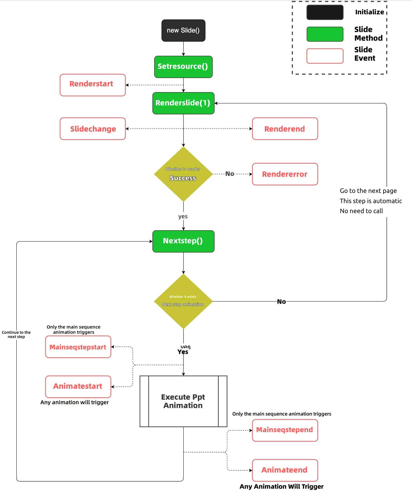
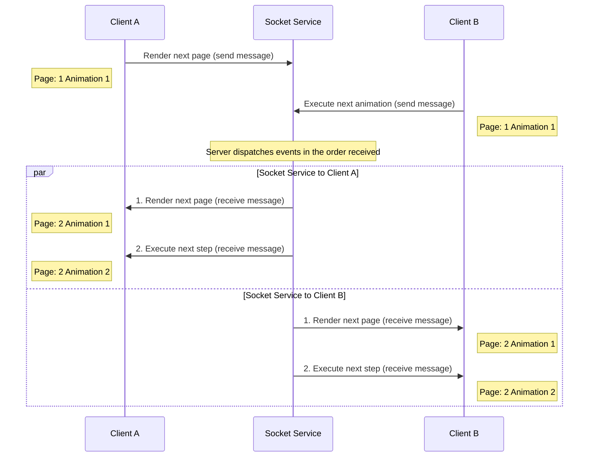
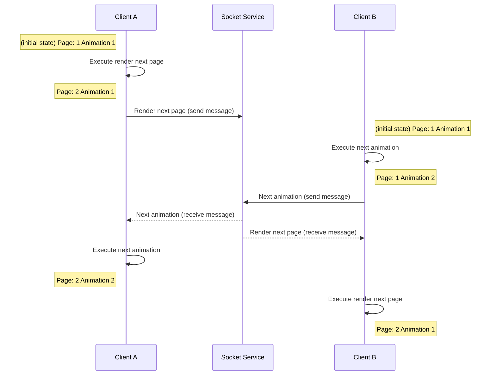

# netless-slide demo

English | [简体中文](./README.md)

This project is a frontend example of the `@netless/slide` library. You need to have completed the document conversion and obtained the `taskId` and `prefixUrl` to further use `@netless/slide` to display PowerPoint presentations in the browser.

[Online Demo](https://netless-io.github.io/netless-slide-demo/)

## Basic Usage

### Initialize `Slide` Object

To initialize a `Slide` object, you need to specify at least three configuration items:

| key | type | description |
| ---- | ---- | --- |
| anchor | HTMLElement | The mount point for the `canvas` element rendered by `Slide` |
| interactive | boolean | Whether the ppt is interactive; non-interactive ppts cannot respond to user events |
| mode | "local" \| "interactive" | local: Standalone mode, the Slide object will not trigger any synchronization events.<br/>interactive: Interactive mode, all clients can interact |

```javascript
import { Slide } from "@netless/slide";

const slide = new Slide({
    anchor: someDivElement,
    interactive: true,
    mode: "local",
});
```

### Set Conversion Resources

After creating the `Slide` object, the next step is to set the converted resources. `taskId` is a hash string representing a conversion task id, and `prefixUrl` is a URL address pointing to the root path of the converted resources. Both parameters can be obtained from the [conversion service progress query API](https://developer.netless.link/server-zh/home/server-projector).

**Note**: You need to ensure that accessing resources in the prefixUrl path will not cause cross-origin issues.

```javascript
slide.setResource("06415a307f2011ec8bdc15d18ec9acc7", "https://convertcdn.netless.group/dynamicConvert");
```

### Render PowerPoint Pages

After setting the conversion resources, you can call `renderSlide` to render pages. The parameter passed is the ppt page number, starting from 1. You can also call `renderSlide` to jump to any page number.
You need to ensure that the passed page number is within the range of the original ppt pages. Access `slide.slideCount` to get the total number of pages.

```javascript
// Render the first page
slide.renderSlide(1);

// Render the last page
slide.renderSlide(slide.slideCount);
```

## Slide Lifecycle and Event Trigger Timing



## Optional Configuration Options

### `Slide` Configuration

There are some optional configuration items for initializing `Slide`, described as follows:

```javascript
const slide = new Slide({
    anchor: someDivElement,
    interactive: true,
    mode: "local",
    // The following are optional configurations
    resize: false,
    enableGlobalClick: false,
    timestamp: Date.now,
    renderOptions: {

    }
});
```

| key | type | description |
|-------------------|----------------------------------|----------------------------------------------------------------------------------------------------------------------------------------------------------------------------------------------------------------------------|
| resize | boolean | **Default:** false <br/> Set whether to automatically adjust resolution based on window size.<br/> By default, the css size of the ppt changes with the size of the anchor element, but the rendering resolution of the canvas element does not change. Setting this value to true will make the resolution of the canvas also scale with the scaling ratio, which can achieve better performance, but when the anchor's css size is too small, it will also cause the screen to become blurry.<br /> Unless there are performance issues, it is generally not recommended to set this to true. |
| enableGlobalClick | boolean | **Default:** false <br/> Used to control whether the next step function can be performed by clicking the ppt screen.<br /> It is recommended to enable this on mobile devices. Due to the limited screen size on mobile devices, the interactive UI is small. If this function is enabled, it will be more convenient to perform the next step. |
| timestamp | () => number | **Default:** Date.now <br/> This function is used to get the current time. In synchronous and interactive scenarios, the ppt internally needs to know the current time. This time should be consistent for multiple clients participating in synchronization (interaction). The more accurate this time is, the more accurate the screen synchronization will be.<br />It is recommended to distribute the same time to multiple clients through a backend service. |
| rtcAudio | RtcAudioClazz | **Default:** null <br/> Used for rtc audio mixing, see below for specific usage |
| logger | ILogger | **Default:** null <br/> Used to receive logs, see below for specific usage |
| useLocalCache | boolean | **Default:** true <br/> Whether to enable local caching. When enabled, ppt remote resources will be cached in indexDB |
| renderOptions | ISlideRenderOptions object | See table below |
| urlInterrupter | (url: string) => Promise<string> | **Default:** url <br/> Returns an accessible address based on the public address (for private storage services) |
| navigatorDelegate | INavigatorDelegate | **Default:** undefined <br/> PPT page navigation delegate. After adding this attribute, all page number changes caused by internal ppt actions go through this delegate logic. Opening a web page in PPT needs to go through the openUrl method, and turning pages in PPT needs to go through the gotoPage method. See the "Adding Custom link" section below for specific usage. |
| customLinks | CustomLink[] | **Default:** undefined <br/> Custom link configuration array, used to add custom jump links to elements in PPT. See the "Adding Custom link" section below for specific usage. |
| clientId | string | **Default:** undefined <br/> Client unique identifier, which needs to be able to distinguish each different client in synchronization and interactive scenarios. For the receiving end of synchronization messages, this ClientId needs to be used to distinguish whether it received a message sent by itself. If this value is not provided in synchronization and interactive scenarios, it may lead to inconsistent states in some cases. |
| enableTracking | boolean | **Default:** true <br/> Whether to enable log tracking. When enabled, local logs will be uploaded to the sdk remote server regularly and quantitatively |
| enableWebAudio | boolean | **Default:** false <br/> Whether to use Web Audio API to play audio |
| resourceTimeout | number | **Default:** 15000 <br/> Resource loading timeout in milliseconds |
| fixedFrameSize | { width: number; height: number; } | **Default:** undefined <br/> Set fixed width and height for the ppt. After setting, the ppt will not automatically change with the parent element size. If there is a scaling requirement, you need to call the updateFixedFrameSize method. The unit of width and height attributes is px. |

#### urlInterrupter Example
```ts
const urlInterrupter = async (url: string) => {
    // There will be different implementations for different cloud storage services, generally by adding signatures to query parameters
    const { ak, expire } = await getSTSToken() // Implemented by customer service
    return `${url}?expire=${expire}&ak=${ak}`
};
```

### ISlideRenderOptions Configuration

| key | type | description |
| ---- | ---- | --- |
| minFPS | number | **Default:** 40 <br/> Set the minimum fps. The application will try to ensure that the actual fps is higher than this value. The smaller this value, the smaller the CPU overhead. |
| maxFPS | number | **Default:** 50 <br/> Set the maximum fps. The application will ensure that the actual fps is lower than this value. The smaller this value, the smaller the CPU overhead. |
| resolution | number | **Default:** window.devicePixelRatio for PC browsers; 1 for mobile browsers.<br/> Set the rendering resolution multiplier. The original ppt has its own pixel size. When displayed on 2k or 4k screens, if displayed according to the original ppt resolution, the screen will be relatively blurry. You can adjust this value to make the screen clearer, but the performance overhead also becomes higher.<br /> It is recommended to keep the default value, or fix it to 1. |
| autoResolution | boolean | **Default:** false, controls whether to automatically scale the rendering resolution based on the actual fps at runtime, keeping the runtime fps between minFPS and maxFPS |
| autoFPS | boolean | **Default:** false, controls whether to enable dynamic fps. When enabled, fps will be dynamically increased and decreased based on CPU efficiency |
| maxResolutionLevel | number | **Default:** 4 for PC, 2 for mobile. For devices with insufficient GPU performance, it is recommended to lower this value. |
| transactionBgColor | string \| number | **Default:** 0x000000, sets the background color of page transition animations, accepts css color strings or hexadecimal color values ("#ffffff", 0xffffff) |
| forceCanvas | boolean | **Default:** false, whether to force 2D rendering. Forcing 2D rendering will lose some 3D, filters and effects |
| transitionResolutionLevel | number | **Default:** 4 for PC, 2 for mobile. Page transition animation screenshot resolution level |
| antialias | boolean | **Default:** undefined, whether to enable antialiasing |

maxResolutionLevel value explanation:
0. 640*360
1. 960*540
2. 1280*720
3. 1920*1080
4. 3200*1800

### SLIDE_EVENTS Event Description

`@netless/slide` exports the `SLIDE_EVENTS` object, which contains all available event types:

| Event Name | Description |
|--------|------|
| syncDispatch | Synchronization event dispatch, triggered in interactive mode and synchronous mode |
| syncReceive | Synchronization event reception, used to receive synchronization events from other clients |
| syncEventLag | Triggered only in synchronous mode, indicating that synchronization message delay requires full synchronization |
| renderStart | Triggered when the current slide starts rendering |
| renderEnd | Triggered when the current slide finishes rendering |
| renderError | Triggered when the current slide renders an error |
| slideChange | Triggered when the page number changes |
| mainSeqStepStart | Triggered when the main sequence animation starts |
| mainSeqStepEnd | Triggered when the main sequence animation ends |
| animateStart | Triggered when any animation starts |
| animateEnd | Triggered when any animation ends |
| stateChange | Triggered when the slide state changes |
| slideStepEnd | Triggered when the ppt has no next step |
| slideStepStart | Triggered when the ppt has no previous step |
| useraddLink | Triggered when the user clicks an element (only in addLink mode) |

### Interactive Mode

In interactive mode, each client can freely operate the ppt. Like synchronous mode, the `@netless/slide` library notifies the caller of `@netless/slide` of each client's operations through events, and the caller is responsible for delivering these events to all clients (including themselves). Unlike synchronous mode, in interactive mode, the client sending the event also needs to handle the received event.

To use interactive mode, set the `mode` parameter to `"interactive"`.

```javascript
// client A
slideA.on(SLIDE_EVENTS.syncDispatch, (event) => {
    // event is a serializable js object, you don't need to care about the specific information of the event
    // Need to broadcast the serialized event to all clients participating in the interaction (including slideA itself)
    socket.boardcast("slide-sync", JSON.stringify(event));
});
// Unlike synchronous mode, in interactive mode, slideA itself also needs to listen to events from the socket
// And dispatch the event to the slideA object.
socket.on("slide-sync", msg => {
    const event = JSON.parse(msg);
    slideA.emit(SLIDE_EVENTS.syncReceive, event);
});

// client B performs the same logic as clientA, listens to SLIDE_EVENTS.syncDispatch events and broadcasts them
// At the same time, it handles events from the socket itself
slideB.on(SLIDE_EVENTS.syncDispatch, (event) => {
    socket.boardcast("slide-sync", JSON.stringify(event));
});
socket.on("slide-sync", msg => {
    const event = JSON.parse(msg);
    slideB.emit(SLIDE_EVENTS.syncReceive, event);
});
```

#### Event Model in Interactive Mode

In interactive mode, any operation on the slide object is dispatched in the form of an event through the `SLIDE_EVENTS.syncDispatch` event,
until the `SLIDE_EVENTS.syncReceive` event is received will the operation actually be executed.

The following diagram describes the synchronization event flow in interactive mode, where each PPT page has an initial state of page 1 animation 1. Running with the event model where all events go through the server before execution ensures that the final state of each client is consistent.



If messages are not sorted and numbered by the server, the final state inconsistency will occur in interactive mode, as described in the following diagram:



### Overall Synchronization

In some cases, a mechanism is needed to synchronize the state of client A to client B as a whole, rather than completing the synchronization one event at a time. For example: client B disconnects and reconnects to the socket room. At this time, the current state of client A needs to be synchronized to B as a whole.

To this end, `@netless/slide` provides a mechanism for getting and setting the overall state of the application.

```javascript
// Accessing slideState can get a slide state snapshot
const snapshot = slideA.slideState;

// Synchronize slideB's state to slideA's current state
slideB.setSlideState(snapshot);
```

In synchronous mode, the synchronized client B can ask client A for the current state after disconnecting and reconnecting. After client A receives the request, it can use the above API to get the state snapshot.
But in interactive mode, this asking mechanism is not applicable. In interactive mode, all clients should share the same state. To achieve this effect, you can record this state snapshot somewhere (generally on the socket room information). `@netless/slide` will notify you after the state changes. At this time, you can record the latest state.

```javascript
slideA.on(SLIDE_EVENTS.stateChange, snapshot => {
    socket.room.slideState = snapshot;
});

// After client B reconnects, get the state on the room information and set it
socket.on("connect", () => {
    slideB.setSlideState(socket.room.slideState);
});
```

### Race Condition Handling

In interactive mode, since each client can independently interact with the ppt, there is a race condition. For example, client A executes turning to the next page (recorded as event A), and at the same time client B executes switching to the next animation (recorded as event B). The order in which these two events are executed will affect the final state (assuming that before executing the event, it is at the first animation of the first page of the ppt):

**A-B:** Turn the page first, then play the next animation. The final state is the first animation of the second page.
**B-A:** Play the next animation first, then execute the next page. The final state is the 0th animation of the second page.

Both of these events will be passed to the socket server. Whether the socket server dispatches these two events in the order of their actual occurrence time is not important. What is important is that the order in which the two clients receive events must be consistent (A-B or B-A), so as to ensure that the final state of the two clients is consistent. Therefore, you need to ensure that the order of events received by each client participating in the interaction is consistent.

## RTC Audio Mixing

**Note: Only supported since `@netless/slide@0.2.9` version.**

The audio and video designed in the ppt are played using the browser's api by default. If there is a need for rtc audio mixing, you can provide a custom player class to replace the built-in player. The custom player needs to implement the following `RtcAudioClazz` interface.

```typescript
export interface RtcAudio {
    /**
     * Start playing audio.
     */
    play(): void;

    /**
     * Pause audio playback, and the current playback time of the audio remains unchanged
     */
    pause(): void;

    /**
     * Called when the audio object is no longer used
     */
    destroy(): void;

    /**
     * Get the current playback time of the audio, unit: seconds
     */
    get currentTime(): number;
    /**
     * Set the current playback time of the audio, unit: seconds. Note that whether the audio is playing or not, you need to ensure that the setting is successful.
     * If the audio is in a paused state and this value is set, ensure that the next time playback is resumed, it starts from this value.
     */
    set currentTime(time: number);

    /**
     * Return whether the audio is paused
     */
    get isPaused(): boolean;

    /**
     * Return the duration of the audio
     */
    get duration(): number;

    /**
     * Triggered when the audio loading is completed, for example: when the audio meta data is loaded, at this time the actual duration of the audio is known, this event needs to be triggered. It needs to be ensured that when this event is triggered,
     * the updated audio duration can be obtained through the duration attribute
     * @param event
     * @param listener
     */
    on(event: "load", listener: () => void): this;

    /**
     * Triggered when the audio is paused
     * @param event
     * @param listener
     */
    on(event: "pause", listener: () => void): this;

    /**
     * Triggered when the audio starts playing
     * @param event
     * @param listener
     */
    on(event: "play", listener: () => void): this;

    /**
     * Remove all listeners for the specified event
     */
    removeAllListeners(event: string): void;
}

export interface RtcAudioClazz {
    /**
     * Create an rtc player, url is the audio address
     * @param url
     */
    new(url: string): RtcAudio;
}
```

Example code for a custom player implemented in JavaScript can be [referenced](./src/RtcAudioPlayer.js). Pass the custom player class to the constructor of `Slide` to replace the default audio player.

```typescript
import { Slide } from "@netless/slide";

const slide = new Slide({
    anchor: someDivElement,
    interactive: true,
    mode: "local",
    rtcAudio: RtcAudioPlayer,
});
```

For mp3 files, `@netless/slide` directly calls the custom player to play audio.

For mp4 files, the conversion service has extracted the audio of the mp4 into a separate mp3 file. `@netless/slide` mutes the mp4 and plays the corresponding mp3 with the provided custom player.

## Error Handling and Logging

Starting from `@netless/slide@0.3.3`, all errors of the current page will be captured and notified through the `SLIDE_EVENTS.renderError` event,
You can jump to the next page in the callback function of this event.

### Error Type Description

`@netless/slide` exports the `ErrorType` enumeration type, which indicates the error type corresponding to the `SLIDE_EVENTS.renderError` event, described as follows

| Name | Trigger Timing | Recovery Method |
| ---- | ---- | --- |
| ResourceError | Triggered when remote resources (json, png) depended on by the ppt are unavailable. After triggering, the current page cannot be interacted with | Re-render the current page or jump to the next page |
| RuntimeError | Unknown exception. After triggering, the current page cannot be interacted with | Jump to the next page |
| RuntimeWarn | Unknown warning, occurs during the animation process. After triggering, the current frame of the animation appears abnormal, but it does not affect the next frame and page interaction | No special handling required |
| CanvasCrash | Due to insufficient memory, or the canvas is accidentally removed (removing the canvas element without calling slide.destroy() is an accidental removal). After triggering, the canvas element becomes a white screen | Refresh the web page (or destroy the slide object and recreate it) |

```typescript
import { SLIDE_EVENTS, ErrorType } from "@netless/slide";

// SlideError inherits from Error. In addition to message, stack and other properties,
// It also adds errorType and errorMsg attributes,
interface SlideError extends Error {
    errorType: ErrorType;
    errorMsg: string;
}

slide.on(SLIDE_EVENTS.renderError, ({error, index}: {error: SlideError, index: number}) => {
    console.log(`Page ${index} error`);
    if (err.errorType === ErrorType.ResourceError) {
        // Jump to the next page. You can choose how to recover according to specific requirements, for example, pop up a confirmation window before doing the jump action
        slide.renderSlide(index + 1);
    } else if (err.errorType === ErrorType.CanvasCrash) {
        // Need to refresh the page
    } else if (err.errorType === ErrorType.RuntimeError) {
        // Jump to the next page
        slide.renderSlide(index + 1);
    } else if (err.errorType === ErrorType.RuntimeWarn) {
        // No special handling required, you can record logs
    }
});
```

#### Handling Errors Through message Events

Starting from `@netless/slide@0.7.1`, it also supports handling errors through window message events. Mainly used to handle errors on Android and iOS devices. Native code
can directly listen to window's message events on the webview, get error information, and then recover the ppt screen by dispatching message events to window.

**Listen for errors**
```typescript
window.addEventListener("message", evt => {
    if (evt.data.type === "@slide/_error_") {
        const { errorType, errorMsg, slideId, slideIndex } = evt.data;
        // errorType corresponds to the above error types, the only difference is that errorType is a string value here
        // errorType possible types are
        // "RESOURCE_ERROR" corresponds to the above ResourceError
        // "RUNTIME_ERROR"  corresponds to the above RuntimeError
        // "RUNTIME_WARN"   corresponds to the above RuntimeWarn
        // "CANVAS_CRASH"   corresponds to the above CanvasCrash

        // slideId    indicates the unique id of the slide object, which needs to be used when sending recovery messages
        // slideIndex indicates the page number of the error
    }
});
```

**Recover from errors**

To recover from errors, you need to dispatch message events to window. The codes for different recovery methods are as follows:

1. Jump to another page, RESOURCE_ERROR and RUNTIME_ERROR can be recovered in this way
```typescript
window.postMessage({
    type: "@slide/_recover_",
    recoverBy: "renderOtherPage",
    slideId: "${slideId}",        // Use the slideId informed in the error message
    payload: {
        slideIndex: "${slideIndex}",  // Specify which page to jump to. If you want to jump to the next page, you can use the error page number informed in the error message + 1
    }
}, "*");
```

2. Re-render the current page, RESOURCE_ERROR can be recovered in this way
```typescript
window.postMessage({
    type: "@slide/_recover_",
    recoverBy: "reloadCurrentPage",
    slideId: "${slideId}",        // Use the slideId informed in the error message
}, "*");
```

### Logging

#### Get Logs One by One

Starting from `@netless/slide@0.3.3`, an optional logger attribute has been added to `ISlideConfig`. You need to pass in an object that conforms to the following interface

```typescript
interface ILogger {
    info?(msg: string): void;
    error?(msg: string): void;
    warn?(msg: string): void;
}
```

This allows you to receive ppt running logs.

```typescript
import { Slide } from "@netless/slide";

const slide = new Slide({
    anchor: someDivElement,
    interactive: true,
    mode: "local",
    logger: {
        info(msg: string) {
            console.log(msg);
        }
    }
});
```

#### Get Logs Through postMessage

Starting from `@netless/slide@0.7.1`, in addition to the above method of getting logs one by one, you can also get logs in text form through postMessage.

1. Dispatch an event on window to notify `@netless/slide` to start sending logs
```typescript
window.postMessage({
    type: "@slide/_request_log_",
    sessionId: "${sessionId}",  // session identifier
}, "*");
```
2. Receive log text in chunks by listening to message events
```typescript
window.addEventListener("message", (evt) => {
   if (evt.data.type === "@slide/_report_log_") {
       console.log(evt.data.index); // Log current chunk index
       console.log(evt.data.log);   // Log text
       console.log(evt.data.total); // Total number of chunks
       console.log(evt.data.sessionId); // sessionId in "@slide/_request_log_" event
       if (evt.data.index === evt.data.total) {
           // Log collection completed
       }
   }
});
```

## WebGL Context Limit

Browsers generally limit the number of webgl contexts between 8 and 16. For `@netless/slide`, an active Slide instance occupies two contexts, one responsible for 2D rendering and one responsible for 3D rendering.
If you create more Slides than the browser limit, the previously created Slides will lose the webgl context, resulting in rendering exceptions.

**Active Slide Instance** refers to an instance that has not called the `slideInstance.frozen()` method. Its webgl drawing environment can work normally. If you want to freeze the current Slide instance and leave the webgl context for the newly created Slide object, you can
call `slideInstance.frozen()`. This method will take a screenshot of the current ppt screen, save the ppt state, destroy the canvas element, and replace the canvas element with the captured image. After freezing, any operations such as page turning, up (down) step, etc. of the Slide object will fail.

Calling `slideInstance.release()` can restore the Slide object from the frozen state.

You need to control the number of active Slide instances yourself between 4 and 8. It is generally recommended to keep it below 8 on PC and below 4 on mobile.

Suggestions for controlling active ppts:
1. Monitor page visibility through [Page_Visibility_API](https://developer.mozilla.org/en-US/docs/Web/API/Page_Visibility_API). When the page is not visible, freeze the Slide object, and unfreeze the Slide when the page resumes.
2. If there are multiple active PPTs on the same page, you can set a fixed-length active PPT queue, activate the Slide that currently gets focus and push it into the queue, and freeze the Slide that is squeezed out of the queue.

## Local Cache Management

`@netless/slide` uses indexDB to cache network resources and temporarily generated textures. `@netless/slide` is not responsible for cleaning up cached data. You need to clean up this part of data at an appropriate time.

Two APIs related to cleaning up cache, the instance method clearSlideCache and the static method clearLocalCache. The former cleans up the current ppt cache, and the latter cleans up all caches. Note that clearSlideCache needs to be called before calling slide.destroy, otherwise the cleanup work cannot be completed.

```typescript
/**
 * Destroy the local cache of the current Slide instance, must be called before destroy.
 */
clearSlideCache(): void;
/**
 * Destroy all historical local caches
 */
static clearLocalCache(): void;
```

### Resource Proxy

**Note: Only supported since `@netless/slide@0.4.0` version.**

Starting from `@netless/slide@0.4.0`, you can provide a loaderDelegate object when creating a Slide object, thereby proxying all remote resources inside Slide, and further implementing
Requirements such as resource redirection and resource authentication.

The loaderDelegate attribute needs to conform to the `ILoaderDelegate` interface. Note that for media resources, you cannot directly return resource content, you can only synchronously return the redirected resource address.

```typescript
export interface ILoaderDelegate {
    /**
     * Load json resources, need to return json text
     * @param url Original resource address
     */
    loadJson(url: string): Promise<string>;
    /**
     * Load image resources, need to return Blob object
     * @param url Original resource address
     */
    loadImage(url: string): Promise<Blob>;
    /**
     * Media file redirection, mp3 and mp4 resources will call this proxy function, need to return the redirected url
     * @param url Original resource address
     */
    redirectMedia(url: string): string;
}
```

A loaderDelegate that does nothing is shown below, but you can process the passed url:

```typescript
import { Slide, ILoaderDelegate } from "@netless/slide"

const delegate: ILoaderDelegate = {
    async loadJson(url: string): Promise<string> {
        const res = await fetch(url);
        return await res.text();
    },
    async loadImage(url: string): Promise<Blob> {
        const res = await fetch(url)
        return await res.blob();
    },
    redirectMedia(url: string): string {
        return url;
    }
}

const slide = new Slide({
    /// ... other initialization configurations
    loaderDelegate: delegate,
})
```

## Global Events

### Page Rendering

The page rendering process refers to from the loading of resources depended on by the page to the completion of page display.

```javascript
window.addEventListener("message", evt => {
    if (evt.data.type === "@slide/_render_start_") {
        console.log(evt.data.taskId); // taskId of the ppt conversion task
        console.log(`Page ${evt.data.index} starts rendering`);
    } else if (evt.data.type === "@slide/_render_end_") {
        console.log(evt.data.taskId); // taskId of the ppt conversion task
        console.log(`Page ${evt.data.index} ends`);
    }
});
```

### Offline Cache

Offline cache will cache resources in json, png formats and resources such as svg generated at runtime to indexDB.

```javascript
// Initiate offline cache
// Cache specified pages, only supported since @netless/slide^1.4.21
window.postMessage({
    type: "@slide/_preload_slide_",
    taskId: "", // taskId of the conversion task,
    prefix: "", // resource prefix returned by the conversion task
    pages: [1,2,3,4,5],  // cache pages 1 2 3 4 5
    sessionId: '12345', // pass randomly, used to distinguish different caches
}, "*");


window.postMessage({
    type: "@slide/_preload_slide_",
    taskId: "",
    prefix: "",
    pages: [1,2,3,5,8,13], // cache pages 1 2 3 5 8 13, can cache by skipping pages
    sessionId: "32345",
}, "*");

// Do not pass pages to cache all pages
window.postMessage({
    type: "@slide/_preload_slide_",
    taskId: "",
    prefix: "",
    sessionId: "all",
}, "*");


// @netless/slide@1.4.4 to @netless/slide@1.4.21 previous version cache method
// Only supports caching all pages
window.postMessage({
    type: "@slide/_preload_slide_",
    taskId: "",
    prefix: "",
    // Do not pass sessionId
    // sessionId: "all",
}, "*");


// Listen to cache progress
window.addEventListener("message", evt => {
    if (evt.data.type === "@slide/_preload_slide_progress_") {
        const { sessionId, taskId, progress } = evt.data;
        console.log(sessionId, taskId, progress);
    } else if (evt.data.type === "@slide/_preload_slide_error_") {
        // Cache error taskId of the ppt conversion task
        const { sessionId, taskId, error } = evt.data;
        console.log(sessionId, taskId, error);
    }
});
```

## More Usage

### Add Custom `link` to Converted PPT

To use the complete functionality, 2 steps are required
1. Add custom `link` in ppt

    `@netless/slide@1.4.32` and above versions support `addlink` mode, which can add custom `link` events in converted PPTs. And get the id of the element clicked by the user by listening to the `SLIDE_EVENTS.useraddLink` event.
    ```javascript
    import { Slide, SLIDE_EVENTS } from "@netless/slide";

    const slide = new Slide({
        anchor: someDivElement,
        interactive: true,
        mode: "addLink",
        logger: {
            info(msg: string) {
                console.log(msg);
            }
        }
    });

    slide.current.on(SLIDE_EVENTS.useraddLink, (taskId: string, pageIndex: number, shapeId: string) => {
        console.log("useraddLink", taskId, pageIndex, shapeId);
    });
    ```
    You can get the `shapeId` of the element clicked by the user through the `SLIDE_EVENTS.useraddLink` event, and let the user input the `link` that needs to be jumped when using other modes for rendering through a pop-up window or other means, and then pass it into `slide` for use
    Note: This method cannot overwrite the original `link`, it can only add click events to elements without them. `addLink` is only used as a mode for adding custom `links` and should not be used in multi-person rooms.

2. Pass the prepared `link` into `slide`
    Also requires `@netless/slide@1.4.32` or above version. When creating a `slide` instance, pass in `customLinks` and `navigatorDelegate`
    ```typescript
    import { Slide, CustomLink } from "@netless/slide";
    const customLinks: CustomLink[] = [
        {
            "pageIndex": 1,
            "shapeId": "slide-3",
            "link": "random11=1"
        }
    ];

    const slide = new Slide({
        anchor: someDivElement,
        interactive: true,
        mode: "interactive", // choose as needed
        // custom link information
        customLinks: customLinks,
        logger: {
            info(msg: string) {
                console.log(msg);
            }
        },
        // custom link jump logic
        navigatorDelegate: {
            openUrl(url: string) {
                console.log("open url", url);
            }
        }
    });
    ```
    After clicking the element, the `navigatorDelegate.openUrl` function will be triggered and the `url` will be passed in. You can customize the action to be completed according to the `url` parameter
